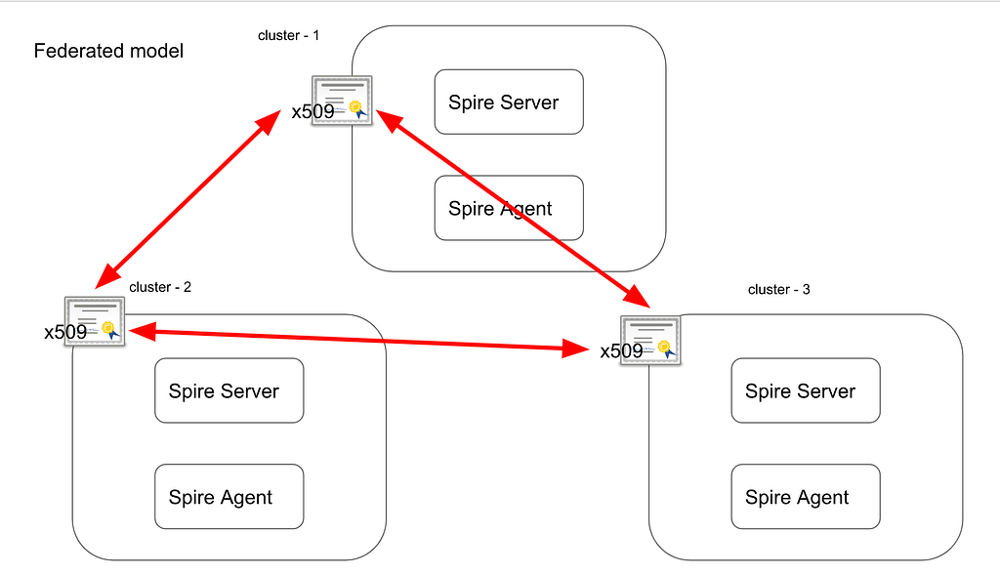
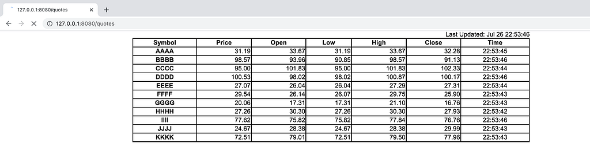
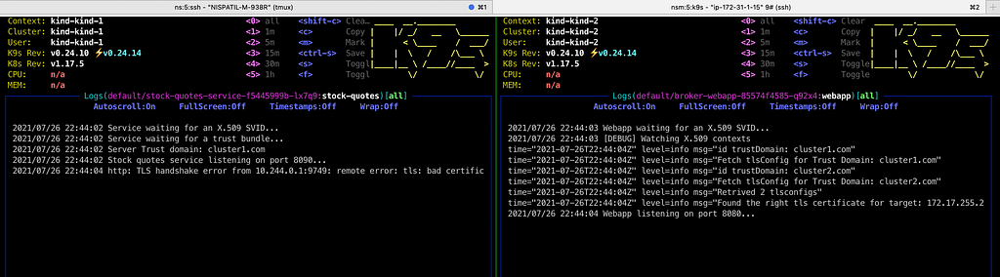

<a href="https://spiffe.io/">spiffe.io</a> is a universal identity control plane for distributed systems.

SPIFFE is a set of standards to help us achieve zero trust identity framework. And SPIRE is one of the implementation of SPIFFE. SPIRE can authenticate and authorize workloads in a distributed system.

SPIRE can be deployed in variours methods. Ex: Single trust domain, Federation and Nested. SPIRE Federation is one of the deployment architectures of SPIFFE/SPIRE. <a href="https://spiffe.io/docs/latest/architecture/">https://spiffe.io/docs/latest/architecture/</a>
<figure></figure>
To set up spire federation for two different trust domains, we need to set up spire-server and agent in two different platforms and federate them with each other using external IP address obtained by load balancers.

In our case let us setup spire federation in Kubernetes clusters by deploying spire components and two workloads server and client in both of the kind clusters.

Generally, we establish connection using grpc.dial which is insecure and end up with non-encrypted communication between workloads, this can be secured using mTLS connection made along with grpc.dial connection.
<h3>Spire Federation Example using Spiffe Authentication</h3>
Using an example from SPIRE official user guide for Federation model added here.

<a href="https://github.com/spiffe/spire-tutorials/tree/master/docker-compose/federation">spire-tutorials/docker-compose/federation at master · spiffe/spire-tutorials</a>

I modified the server-client example to be deployable in Kubernetes clusters with SPIRE server-agent model. This example demonstrates a simple a stock quote webapp frontend and service backend by setting up two SPIFFE-identified workloads that are identified by two different SPIRE Servers.

Let’s say we have a stock broker’s webapp that wants to display stock quotes fetched from a stock market web service provider. The scenario goes as follows:
<ol><li>The user enters the broker’s webapp stock quotes URL in a browser.</li><li>The webapp workload receives the request and makes an HTTP request for quotes to the stock market service using mTLS.</li><li>The stock market service receives the request and sends the quotes in the response.</li><li>The webapp renders the stock quotes page using the returned quotes and sends it to the browser.</li><li>The browser displays the quotes to the user. The webapp includes some JavaScript to refresh the page every 1 second, so every second these steps are executed again.</li></ol>
I have pushed the codes to below repository. Server hold the set of secure information and client exposes an http endpoint that we can open up in a web browser. The connection between Server-Client is gRPC protocol and we’ll secure this connection by setting up mTLS connection using SPIFFE identity framework.

First, let’s clone below repository
<pre>git clone <a href="https://github.com/nishantapatil3/spire-federation-kind">https://github.com/nishantapatil3/spire-federation-kind</a></pre>
Lets build our server and client
<pre>./1-build.sh</pre>
Create two clusters using kind, follow instructions as below <a href="https://kind.sigs.k8s.io/docs/user/quick-start/#creating-a-cluster">https://kind.sigs.k8s.io/docs/user/quick-start/#creating-a-cluster</a>

Lets name them as kind-1 and kind-2 in our case
<pre># Create kind clusters kind create cluster --name kind-1 kind create cluster --name kind-2</pre><pre># Export kubeconfig to desired location mkdir -p ~/kubeconfigs kind get kubeconfig --name=kind-1 &gt; ~/kubeconfigs/kind-1.kubeconfig kind get kubeconfig --name=kind-2 &gt; ~/kubeconfigs/kind-2.kubeconfig</pre>
Once you have two clusters running, deploy metallb and spire components

We need to install metallb load balancer to allow external traffic to reach pods inside our kubernetes cluster by external ip services
<pre># Apply the helm chart</pre><pre>helm template helm/metallb-system --set globalPrefix=&quot;255&quot; | kubectl apply --kubeconfig $cluster1 -f - helm template helm/metallb-system --set globalPrefix=&quot;254&quot; | kubectl apply --kubeconfig $cluster2 -f -</pre>
After we have load balancers in our clusters we have to deploy spire-server and spire-agent

To do that lets apply helm charts using below cmd
<pre>helm template helm/spire --set trustDomain=cluster1.com --set federatesWith[0].trustDomain=cluster2.com --set federatesWith[0].address=172.17.254.1 --set federatesWith[0].port=8443 | kubectl apply --kubeconfig $cluster1 -f -</pre><pre>helm template helm/spire --set trustDomain=cluster2.com --set federatesWith[0].trustDomain=cluster1.com --set federatesWith[0].address=172.17.255.1 --set federatesWith[0].port=8443 | kubectl apply --kubeconfig $cluster2 -f -</pre>
Next, bootstrap spire certificates with each other such that the workloads (server and client) can get the certificate from either trust domains to establish connection
<pre>$ ./2-bootstrap.sh Setting clusters kubeconfig /home/ubuntu/spire-federation-kind/lab_clusters.sh Bootstrap certificate from cluster1 to cluster2 bundle set. Bootstrap certificate from cluster2 to cluster1 bundle set.</pre>
Run the following command to create spire entries so that spire server can know which trust domain certificate the workload can fetch from to connect to its target

Client gets two certificates and iterates over them to find the right certificate
<pre>$ ./3-register.sh Setting clusters kubeconfig /home/ubuntu/spire-federation-kind/lab_clusters.sh ------------------------- Registering workload: server Entry ID      : 12c07f5f-8629-4654-9961-dd6dbeba577e SPIFFE ID     : spiffe://cluster1.com/server Parent ID     : spiffe://cluster1.com/spire-agent Revision      : 0 TTL           : default Selector      : k8s:sa:server-service-account FederatesWith : spiffe://cluster2.com</pre><pre>------------------------- ------------------------- Registering workload: client Entry ID      : 8082ce59-4bca-43a5-83d5-006890f822b5 SPIFFE ID     : spiffe://cluster2.com/client Parent ID     : spiffe://cluster2.com/spire-agent Revision      : 0 TTL           : default Selector      : k8s:sa:client-service-account FederatesWith : spiffe://cluster1.com</pre><pre>-------------------------</pre>
Deploy server in cluster1 and client in cluster2
<pre>$ kubectl apply -f helm/server.yaml --kubeconfig $cluster1 serviceaccount/server-service-account created service/stock-quotes-service created deployment.apps/stock-quotes-service created $ kubectl apply -f helm/client.yaml --kubeconfig $cluster2 serviceaccount/client-service-account created service/broker-webapp created deployment.apps/broker-webapp created</pre>
Now we can Port forward the client pod to your localhost:8080 using kubectl, get the client-pod name and replace below cmd
<pre>Example: kubectl port-forward broker-webapp-85574f4585-cxvxg 8080:8080 — kubeconfig $cluster2</pre><pre>$ kubectl port-forward broker-webapp-85574f4585-q92x4 8080:8080 --kubeconfig $cluster2 Forwarding from 127.0.0.1:8080 -&gt; 8080 Forwarding from [::1]:8080 -&gt; 8080 Handling connection for 8080 Handling connection for 8080 Handling connection for 8080 Handling connection for 8080 Handling connection for 8080</pre>
Open up a browser to <a href="http://localhost:8080/quotes">http://localhost:8080/quotes</a> and you should see a grid of randomly generated phony stock quotes that are updated every 1 second.
<figure></figure>
Server (left k9s) and client (right k9s), you can see that client fetched two certificated from cluster1.com and cluster.com, iterated over these certificates and picked the right one for the target
<figure></figure>
Congrats you have successfully created spire federated clusters!!
<h4>Conclusion</h4>
What Spire can do?
<ul><li>Secure microservices communication</li><li>Validates cryptographic service identities</li><li>Eliminates the need for secret management</li><li>Automatically issues, distributes, and renews short-live credentials</li><li>Reduces operational overhead associated with credential management</li></ul>

---

Originally published on Medium: https://medium.com/@nishant.apatil3/spiffe-spire-federation-implementation-on-kind-clusters-d5f3b7c4c062?source=rss-adc0a729355------2
