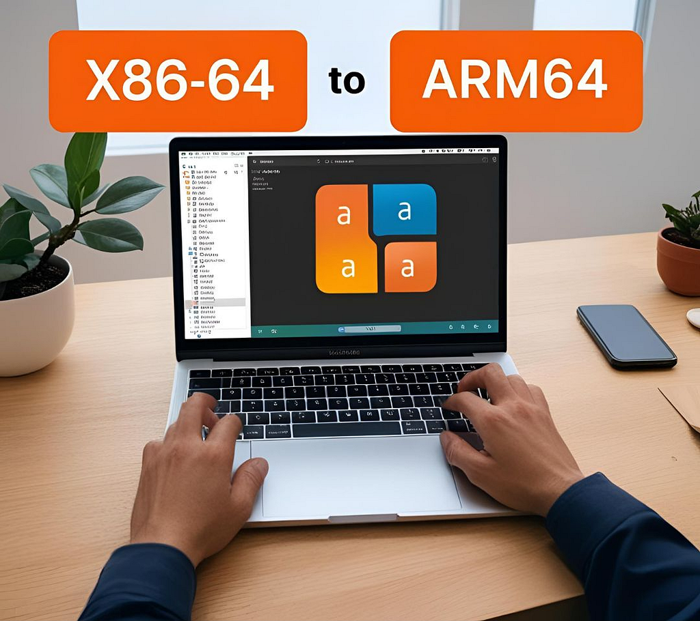
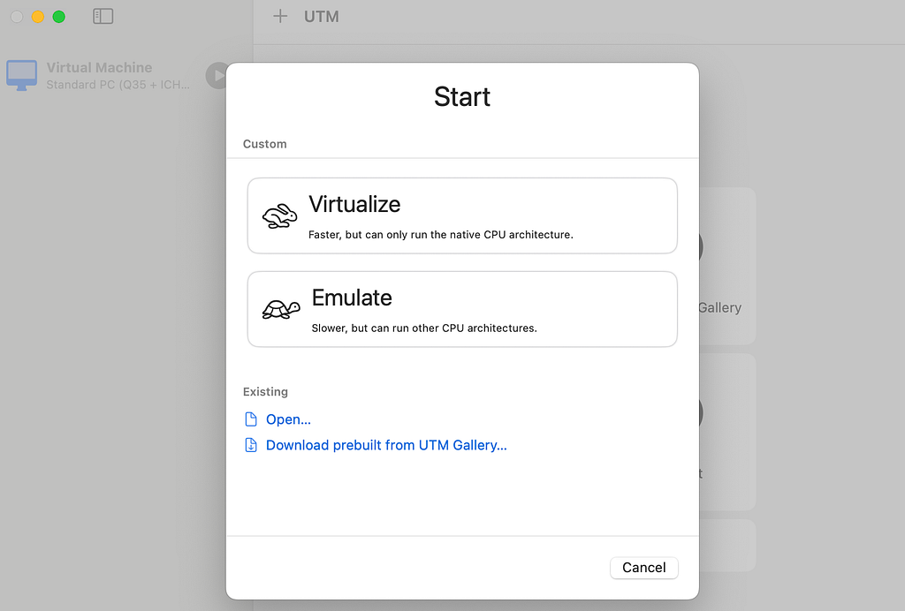
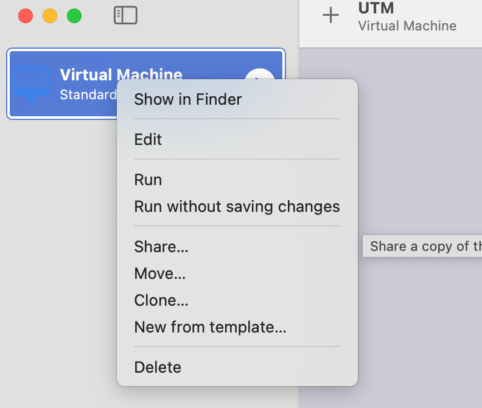

Steps to export qcow2 from Mac arm64/darwin
<figure></figure><blockquote>We will use these terms interchangably — amd64, AMD64, x86–64, and x64 all signify the same 64-bit computer architecture</blockquote><h4>Overview</h4>
When Apple transitioned from Intel-based architecture to its custom ARM64-based CPUs, starting with the M1 chip, it marked a significant shift in the computing landscape. While this move brought notable performance and efficiency gains, it also introduced challenges for developers, particularly when building multi-architecture applications on virtual machines (VMs) or Docker containers.

The incompatibility between x86–64 and ARM64 architectures has forced developers to adopt workarounds, such as using Rosetta 2 for emulation or specifying platform flags during Docker builds. Despite these efforts, cross-platform compatibility remains a complex hurdle, especially for those managing diverse development environments.

The most commonly encountered difficulties are with VMs, as even today, not all SaaS/IaaS providers have transitioned from using VMs to Docker containers. There are still plenty of providers relying on VMs to deliver services.

It is essential for developers to be able to develop virtual machines (VMs) locally on laptops or desktops and then copy them to development instances for testing and validating applications. However, a common challenge arises with cross-compiling applications for various platforms. One of the easier methods to address this issue is packaging the application in a VM file format, such as OVA or QCOW2.
<h4>Solution</h4>
Our target architecture is amd64/x86_64. But most of us use Mac M series laptops that have arm64 based darwin architecture.

VMware Fusion / Workstation Pro doesn’t support emulation. They support Virtualization only on native CPU, so amd64 based image cannot be generated. The same goes with VirtualBox as well.

Solution is to use UTM: <a href="https://github.com/utmapp/UTM">https://github.com/utmapp/UTM</a>. Open-source and free to use. UTM provides us the support of both emulation and simulation which can help us to run amd64 based images on ARM 64 based Mac.

We can use UTM to emulate an AMD64 virtual machine (VM). UTM also provides an additional feature to export the emulation as a “*.utm” file. This file is essentially a directory that can be navigated. Inside the “.utm” directory, you will find another file in the QCOW2 format.
<blockquote>Alternatively, we can use QEMU, If you are good with command lines. UTM is based off of QEMU.</blockquote>
Step 1: Download and install UTM

<a href="https://mac.getutm.app/">UTM</a>

And, download amd64(or any other) based iso files. Ex: ubuntu-amd64.iso

Step 2: Start UTM and select “Emulate”
<figure><figcaption>UTM screenshot</figcaption></figure>
Step 3: After installing and booting up your Ubuntu, export it or use share to export.
<figure></figure>
Step 4: find qcow2 file after navigating to the exported “*.utm” file
<pre>❯ l test-vm.utm/Data/ total 1092104 -rw-r--r--@ 1 user  staff   320K Apr  2 15:37 646B2B8A-4C86-4112-B9DB-4AB60A66295B.qcow2 ...</pre>
Use this qcow2 file as virtual disk in your VM development environment or convert it to any other format using qemu-img tool.
<pre>qemu-img convert -p -f qcow2 -O vmdk myimage.qcow2 newimage.vmdk</pre><h4>Conclusion</h4>
There you have it amd64 based qcow2 format generated from arm64 based system.

---

Originally published on Medium: https://medium.com/@nishant.apatil3/export-amd64-x86-64-vm-on-mac-darwin-arm64-907d4beae417?source=rss-adc0a729355------2
