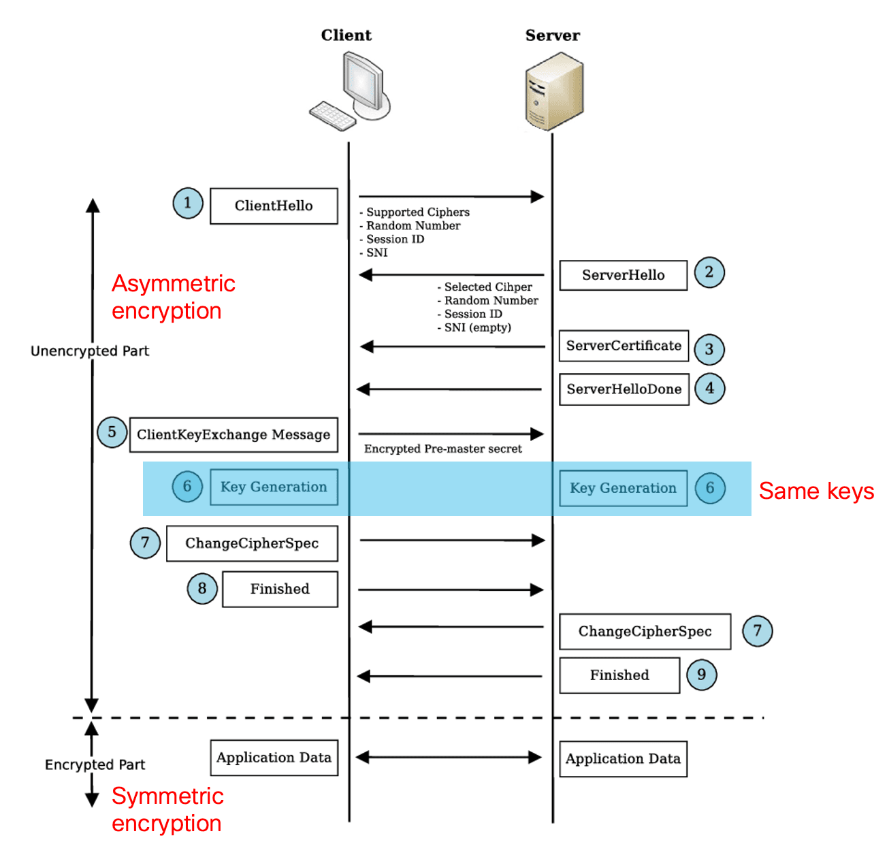
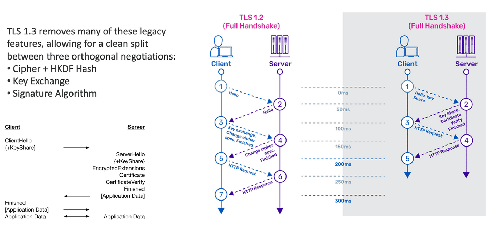
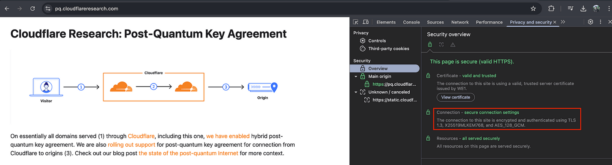
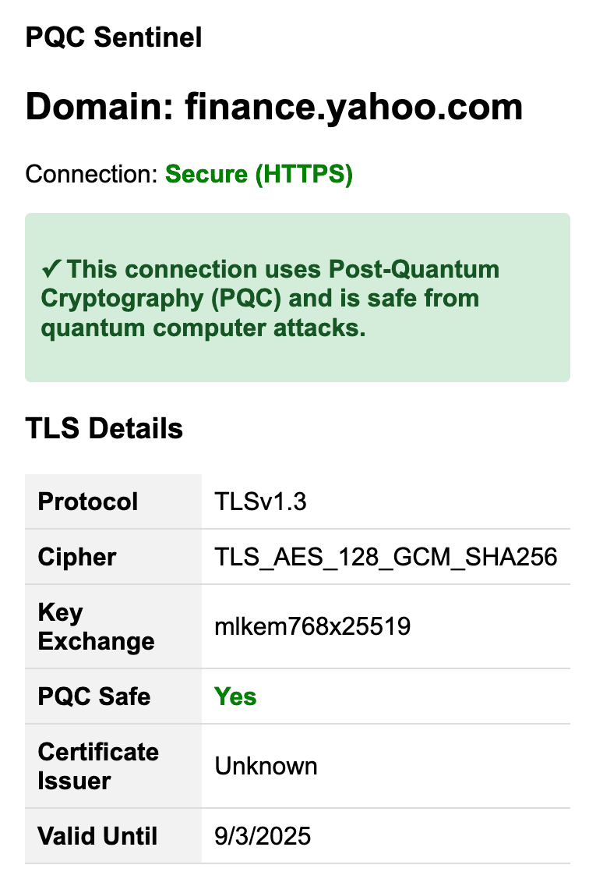

Humanity has achieved significant advances in semiconductor technology, ushering in an era where quantum computing is becoming increasingly feasible. Quantum computers, which operate based on the principles of quantum mechanics, have the potential to <a href="https://newsroom.cisco.com/c/r/newsroom/en/us/a/y2025/m07/at-cisco-bold-steps-towards-a-quantum-network.html" target="_blank" class="">solve certain complex problems</a> much faster than traditional computers. However, despite rapid progress, building large-scale, practical quantum computers remains a challenge due to ongoing engineering and scientific hurdles.

Post-quantum cryptography (PQC) is an emerging concern for all encrypted traffic on the Internet. But why should this matter to you? Through a real-world lens we’ll explore why PQC is relevant and what you can do to stay secure.
<h3>What do quantum computers mean for the future?</h3>
Quantum computers have a wide range of applications, from healthcare to finance, and are theoretically capable of decrypting the most complex encryption used on today’s Internet. Thanks to their quantum nature, they can <a href="https://medium.com/technological-singularity/feynmans-path-integral-approach-to-quantum-mechanics-66371ee1c810" target="_blank" class="">explore all possible solutions</a> simultaneously and stand to revolutionize everything from drug discovery to security risks.

This means that the cryptography used in initial handshake — where Transport Layer Security (TLS) establishes a secure connection and comprises almost all of the secure internet traffic today — could be decrypted by a quantum computer in a matter of minutes or hours. This can potentially allow any bad actors to gain access to encrypted data anywhere.

To avoid this data leak several players in technology have started to incorporate PQC in real-world&nbsp;scenarios:
<ul><li><strong>Telecom and mobile:</strong> SK Telecom’s Galaxy Quantum2 and Verizon’s QKD trials show PQC and quantum encryption moving into mainstream networks.</li><li><strong>Messaging apps:&nbsp;</strong>Apple iMessage (PQ3) and Signal now use hybrid post‑quantum protocols to secure chats.</li><li><strong>Cloud and network security:</strong> AWS and Google are piloting PQC algorithms aligned with the National Institute of Standards and Technology (NIST) standards for future‑safe encryption.</li><li><strong>Government and defense:&nbsp;</strong>Defense agencies and industry alliances (e.g., PQC Alliance) are deploying PQC to protect national security and critical systems.</li></ul><h3>Post-quantum cryptography:&nbsp;Why does PQC matter?</h3>
While we don’t yet have fully functional quantum computers capable of decrypting Internet traffic, we should still be concerned and <a href="https://outshift.cisco.com/blog/cisco-research-quantum-resistant-security-summit" target="_blank" class="">prepare for the future</a>. This is due to the well-known principle: Harvest now, decrypt later (HNDL).

Any communication conducted today can be stored and in the future — once quantum computers become widely available — those stored encrypted communications could be decrypted.

Types of data stored by attackers in HNDL scenarios include highly sensitive and long-lasting information such as personal identifiers (e.g., social security numbers), financial records, government secrets, military communications, corporate intellectual property, and confidential emails. This data is especially valuable because it retains its importance and usefulness over many years, unlike more transient data like credit card numbers, which expire or change quickly.&nbsp;
<h3>Where are quantum computers a real threat?</h3>
Most Internet traffic uses TLS connections, such as HTTPS. These connections are established using symmetric keys generated on both the client and server sides. To generate these symmetric keys, participants first exchange information using asymmetric encryption. This initial asymmetric exchange is where quantum computers pose the greatest threat.

Once the handshake is complete, application data is encrypted using symmetric keys. Generally, symmetric encryption is considered quantum-safe if the key length is sufficiently large (for example, AES-256 is PQC-safe, while AES-128 is not). Increasing the key size of current encryption methods can help protect application data.

However, asymmetric keys (such as RSA and ECDH) can be easily broken by quantum computers. As of today, quantum computers lack the power and stability (due to limited qubits and error rates) to break these keys, but this will likely change in the future.
<h3></h3><h3>TLS 1.3: How can companies become quantum-secure?</h3>
The National Institute of Standards and Technology (NIST) has released new standards (FIPS 203, 204, 205) to help companies adopt modern algorithms that are resistant to quantum attacks. These standards include lattice-based encryption algorithms, which become increasingly difficult to break as their variables grow.

These new Federal Information Processing Standard (FIPS)-approved algorithms are implemented in TLS 1.3 — but not in TLS 1.2, as it is not optimized for PQC and faces significant challenges. TLS 1.2’s encryption methods (RSA and ECDH) can be broken by quantum computers,&nbsp;supports weak encryption options that could be exploited, and can be forced to use less secure settings – making quantum-safe security difficult to guarantee. With this in mind, TLS1.2 is being deprecated, and all the handshake protocols are being upgraded to 1.3.&nbsp;
<figure class="image"><figcaption>TLS 1.3 Handshake</figcaption></figure>
TLS 1.3 brings several improvements:
<ul><li>~33% faster handshakes</li><li>Stronger security</li><li>Simplified protocols</li><li>Support for PQC encryption algorithms</li><li>Protection against downgrade attacks (elimination of vulnerable features)</li><li>Reduced computational overhead</li></ul><h3>PQC-safe handshake algorithms</h3>
The PQC-safe handshakes differ from conventional TLS 1.3 handshakes in key exchange and authentication. While TLS 1.3 natively uses algorithms like Elliptic Curve Diffie–Hellman (ECDHE) for key exchange and Elliptic Curve Digital Signature Algorithm (ECDSA) for authentication, PQC-safe versions replace or—more commonly in the current transition—combine these with PQC algorithms in a “hybrid” handshake. In hybrid handshakes, both a classical ECDHE and a PQC algorithm (such as ML-KEM) are performed, ensuring security even if one method is broken.&nbsp;

Some practical ways to ensure PQC-safe connections:
<ul><li>Using the Chrome browser, try PQC-safe handshakes at Cloudflare PQC Demo.</li></ul><figure class="image"><figcaption>An example of PQC safe server + client handshake</figcaption></figure>
We can see that the supported algorithms as of today are “<a href="https://datatracker.ietf.org/doc/draft-kwiatkowski-tls-ecdhe-mlkem" target="_blank" class="">X25519MLKEM768</a>” and “<a href="https://datatracker.ietf.org/doc/draft-tls-westerbaan-xyber768d00/" target="_blank" class="">X25519Kyber768Draft00</a>” (the latter algo is planned to be obsolete) which are known to be PQC safe algorithms.
<ul><li><a href="https://github.com/open-quantum-safe" target="_blank" class="">Open Quantum Safe project on GitHub</a> and explore implementations.</li><li>Check to see if the currently open website is secure against quantum computing attacks (PQC safe) with <a href="https://addons.mozilla.org/en-US/firefox/addon/pqc-sentinel/" target="_blank" class="">PQC Sentinel</a>.</li></ul><figure class="image image_resized" style="width:26.53%;"><figcaption>Screenshot of PQC Sentinel - Firefox add-on</figcaption></figure><h3>Future-proof your network against quantum threats</h3>
Adhering to the four parameters below will also help future-proof your network against emerging quantum threats while improving current cryptographic resilience.

Four parameters to check for PQC-safety of your network:
<ol><li>The connection must use TLS 1.3.</li><li>Both client and server must support post-quantum hybrid key agreement.</li><li>The connection must successfully negotiate one of the supported hybrid key agreements, specifically:<ol><li>X25519MLKEM768</li><li>X25519Kyber768Draft00</li></ol></li><li>The connection should use PQC-safe symmetric encryption, such as AES-256 or higher.</li></ol><h3>Outshift and Cisco Research: Working against future quantum threats</h3>
Outshift by Cisco and Cisco Research are partnering to drive quantum innovations like&nbsp;<a href="https://blogs.cisco.com/news/quantum-networking-how-cisco-is-accelerating-practical-quantum-computing" target="_blank" class="">Cisco’s Quantum Network Entanglement Chip</a> and&nbsp;<a href="https://outshift.cisco.com/blog/outshift-qrng-api-accessible" target="_blank" class="">Outshift’s Quantum Random Number Generator (QRNG)</a> to enable practical, and safe quantum computing. By equipping companies with quantum networking and security tools to meet today’s needs and future challenges, we’re advancing secure data transmission and laying the foundation for the next generation of quantum-secure networks.

Being prepared for threats and potential losses will help us navigate towards a secure future more easily. This is why we build solutions to identify and aid our customers on their post-quantum cryptography safe journey. Stay ahead of the curve and start preparing for the post-quantum era today! Reach us to learn more on <a href="https://outshift.cisco.com/blog/showcase/quantum-computing" target="_blank" class="">Cisco Quantum</a>.

---

Reposted from Outshift: https://outshift.cisco.com/blog/post-quantum-cryptography-the-path-to-becoming-quantum-safe
