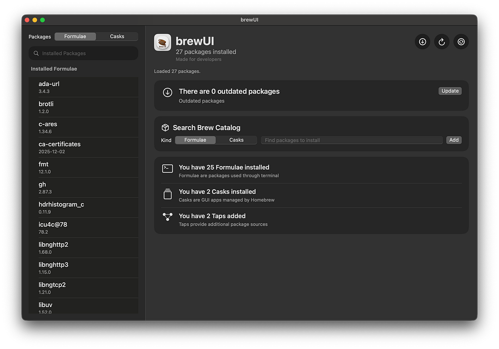

There was one thing that kept bothering me:

Homebrew is incredible, but managing packages still feels like a terminal-first experience for most people.

If you know brew commands, it’s powerful. If you don’t, it can feel intimidating, slow to explore, and hard to visually track what’s installed, outdated, or safe to remove.

I looked for a <strong>free, lightweight</strong> Mac app that focused just on Homebrew package management. I couldn’t find one that matched what I wanted. Everything I tried was either paid, a trial version, or just too difficult to use.

So I built one. A free, open-source app.
<h3>Meet brewUI</h3><figure></figure>
<a href="https://github.com/nishantapatil3/brewUI">brewUI</a> is a native macOS app that gives you a focused interface for Homebrew:
<ul><li>Browse installed <strong>Formulae</strong> and <strong>Casks</strong></li><li>Search and install packages quickly</li><li>Reinstall or uninstall from the UI</li><li>See update indicators for outdated packages</li><li>Run refresh/update flows without digging through commands</li></ul>
No bloat. No “all-in-one system utility suite.” Just a clean interface for one job: managing Homebrew packages.
<h3>Why I built it</h3>
This project came from a simple belief:
<blockquote>Great developer tools should also have great UX.</blockquote>
I didn’t want to replace the terminal. I wanted to complement it.

Sometimes you want command-line precision. Sometimes you want a quick visual dashboard to scan your package state in seconds.

brewUI is for that second moment.
<h3>Built with intention</h3><ul><li>Native SwiftUI app for macOS</li><li>Lightweight architecture</li><li>Homebrew-first workflow</li><li>Open and free to use</li></ul>
I also wired release + Homebrew cask distribution so installing stays simple.
<h3>Try it</h3>
brew install --cask --no-quarantine nishantapatil3/tap/brewui

Project: <a href="https://github.com/nishantapatil3/brewUI">github.com/nishantapatil3/brewUI</a>
<h3>What’s next</h3>
I’m continuing to improve:
<ul><li>Better package detail views</li><li>Smoother update experience</li><li>More power-user actions without losing simplicity</li></ul>
If this sounds useful, I’d love feedback, ideas, and contributions.

If you’re a Mac dev who lives with Homebrew daily, this was built for you.

---

Originally published on Medium: https://medium.com/@nishant.apatil3/i-built-brewui-because-homebrew-deserved-a-clean-free-mac-ui-68c1e187a8df?source=rss-adc0a729355------2
